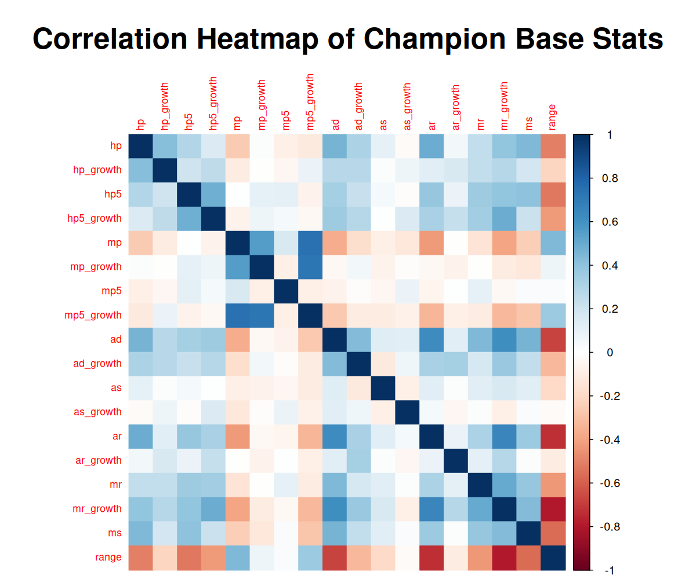
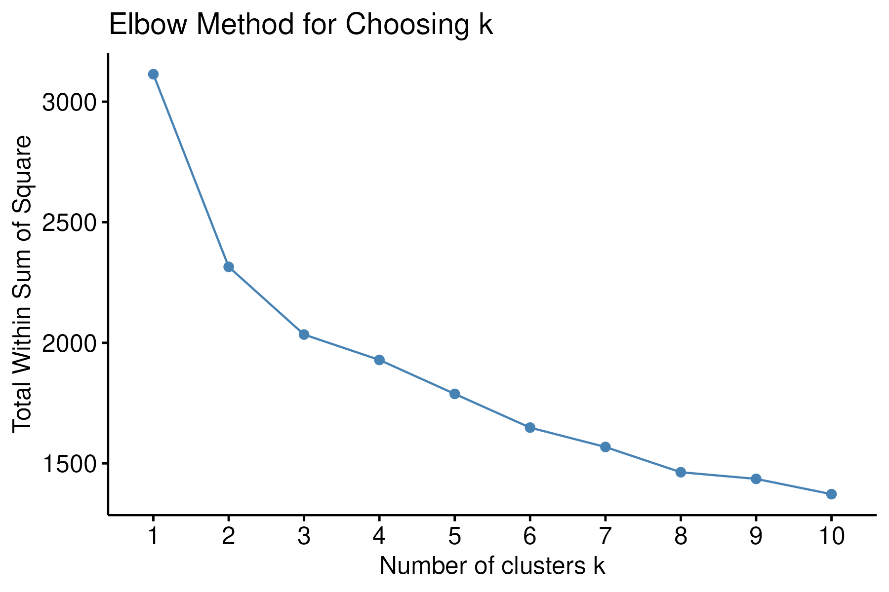
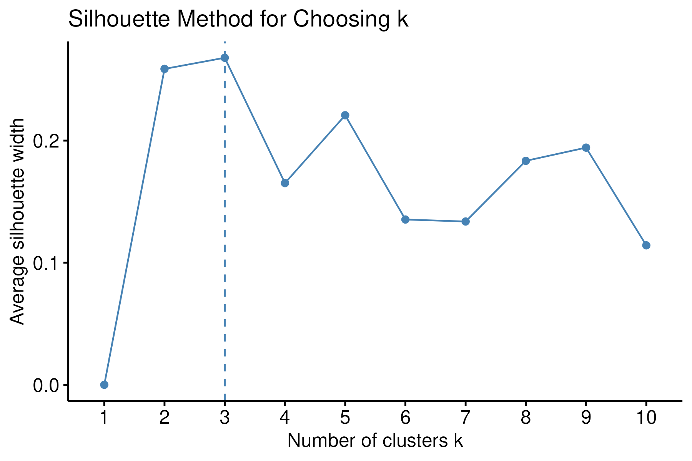
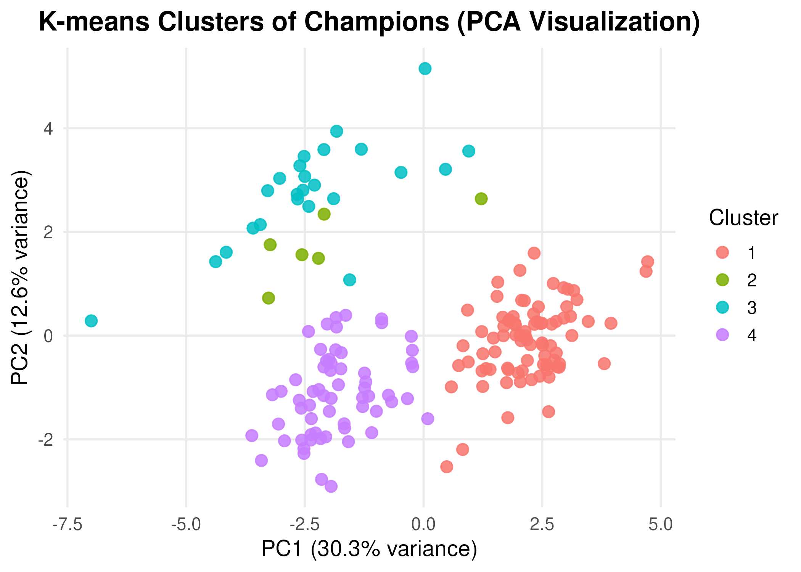
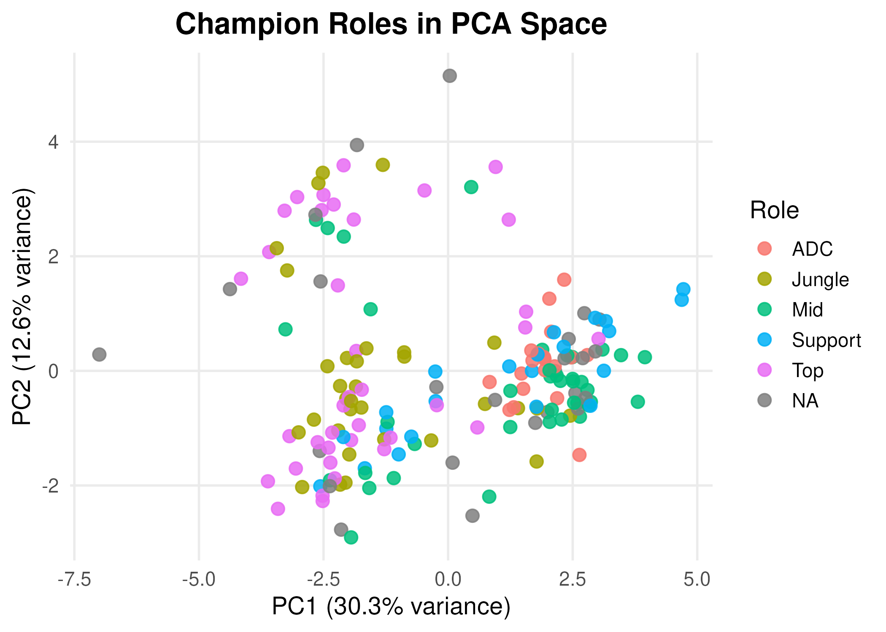

---
title: "League of Legends Champion Clustering Analysis"
author: "Derek Yao"
date: "`r Sys.Date()`"
output:
  pdf_document:
    toc: yes
    number_sections: true
fontsize: 12pt
---

\vspace{9em}

This analysis explores whether League of Legends champion **base statistics** naturally
cluster into meaningful groups, and how those clusters align with **roles** (Top, Jungle,
Mid, ADC, Support).

We evaluate:

- the structure of the base-stat space (EDA)
- optimal cluster number (k)
- clustering results from multiple algorithms
- alignment of clusters with true roles
- feature importance that drives clustering

---

# Data Processing

The cleaned dataset was generated using `01_scrape_clean.R`. We also have another dataset called champions.csv that contains the champion roles. 

# Introduction
This report investigates whether League of Legends champions exhibit natural
cluster structure based on their base statistics alone. We aim to answer:

Do champions cluster naturally in the statistical space?
What is the optimal number of clusters?
What champion groups are discovered by clustering?
Do these clusters align with in-game roles (Top, Jungle, Mid, Bot, Support)?
Which clustering algorithm performs best?
Which champion stats are most important in determining cluster membership?


Before looking at the data, it is important to introduce the game rules and roles. In the game League of Legends, champions are the characters that players choose to control during a match. The game has five major roles: Top, Jungle, Mid, Bot, and Support. These roles have various different champions with certain patterns. For instance, the Top role mostly consists of tanky, high health melee champions while the Bot role has mostly attack damage focused ranged champions. We are trying to see if k-means clustering and other clustering algorithms is able to separate the champions into those in-game roles accurately using just champion base statistics. 

All results and figures in this report were generated automatically by a
Makefile using the R scripts in the R folder.

```{r setup, include=FALSE}
knitr::opts_chunk$set(echo = FALSE, warning = FALSE, message = FALSE)

library(readr)
library(dplyr)
library(ggplot2)
library(knitr)
library(png)
library(grid)
```

# Data Summary
```{r}
summary_stats <- read_csv("tables/summary_stats.csv")
kable(summary_stats, caption = "Summary Statistics of Champion Base Attributes")
```
Here is a summary table of the base statistics across all League of Legends champion. We see that values of certain stats, 
especially HP, mana, and range have high standard deviations. This is because summarizing across all champions means mixing champions with very different roles. For instance, not every champion even has mana points and each role has very different HP values and range. Some champions are melee, while others are ranged. Also, some champions are considered tanks, which are supposed to have higher base HP stats than other champions.


# Correlation Structure
```{r fig-corrplot, echo=FALSE, fig.align='center', out.width='0.8\\linewidth'}

```
This correlation heatmap shows the correlation between all champion base statistics in the dataset. We see strong positive correlations between mana regeneration growth and mana, which makes sense as these two statistics are closely related. Interestingly, there seems to be a positive correlation between armor and attack damage, as well as between magic resistance growth and attack damage. This could be due to the fact that most "tanky" champions in the game use attack damage as their primary source of damage, not magic. Finally, range seems to be negatively correlated with almost all other base statistics besides magic-related statistics. This could be due to the fact that most magic-focused champions are mages, which are mostly ranged. Also, it seems that the higher attack damage, armor, and magic resistance a champion has, it is likely they will have shorter range. This is an interesting observation as one of the five main roles in the game is mostly made up of attack damage ranged champions. 


# Selecting Number of Clusters
```{r, echo=FALSE, fig.align='center', out.width='0.8\\linewidth'}


knitr::include_graphics("figs/gap.png")
```

## Selected k:
```{r}
selected_k <- readLines("results/selected_k.txt")
cat("The selected number of clusters is:", selected_k)
```
We used three different methods to find the optimal number of clusters in this dataset (k). We used the Gap statistic, the Silhouette plot, and the elbow plot. The elbow plot seems to flatten out at around 4 clusters as well, while the silhouette method resulted in an optimal k of 3 clusters, while the gap statistic resulted in an optimal k of 4 clusters. In the end, we chose the number of clusters k to be 4. 


# K-means Clustering Results:
## PCA Visualization of Clusters
```{r, echo=FALSE, fig.align='center', out.width='0.8\\linewidth'}

```
We then created two scatterplots to visualize our clusters in the data. We first ran principal component analysis to be able to visualize our clusters on two dimensions. This PCA scatterplot shows that k-means clustering was mostly able to separate the champions into 4 distinct clusters. There are some notable outliers, especially with the champions Mega Gnar, Yuumi, Senna, and Briar. This may be because in the game, these champions have unique base statistics very different from others in their role. For instance, Yuumi has the lowest base HP in the game and the lowest attack damage and attack speed. 

## PCA Visualization of Clusters by Role:
```{r, echo=FALSE, fig.align='center', out.width='0.8\\linewidth'}

```
This scatterplot colored by roles shows that the clusters were not quite able to cluster the champions by the official game roles, as many of the champions that seem clustered together based on our k-means clustering was actually part of different roles. Therefore, it seems that k-means clustering did not accurately align with in-game roles.


# Examining Alignment with Roles
## ARI and NMI Results:
```{r}
agreement <- read_csv("tables/label_agreement_kmeans.csv")
kable(agreement, caption = "ARI and NMI Against Role Labels")
```
For our external validation of comparing the cluster labels to the true labels, we used Adjusted Rand Index and Normalized Mutual Information as our evaluation metrics. Both results revealed that our k-means clustering method did not accurately separate the champions into their official game roles, as both the ARI and NMI were well below 1.


# Internal Validation: Cluster Quality
```{r}
external <- read_csv("tables/compare_algorithms_external_role.csv")
kable(external, caption = "Comparing ARI and NMI Across Algorithms")
```
We then ran multiple other clustering methods to see if they would perform better for our data. We used GMM, hierarchical clustering, and spectral clustering. ARI and NMI were the metrics we used to compare performance. Overall, it seems that GMM had very slightly better performance in getting the true labels of the in-game roles from the data, while the other three methods had very similar performance.


# Feature Importance:
```{r, echo=FALSE, fig.align='center', out.width='0.8\\linewidth'}
knitr::include_graphics("figs/feature_importance_permutation.png")
```
Finally, we used ANOVA to examine which base statistics were most important in driving the k-means clustering. It seems that many variables contributed significantly to the k-means clustering. According to these results, most mana-based statistics, armor, and attack damage were the most important in the k-means clustering. This makes sense, as these statistics were the most different across different roles.

# Conclusions
In conclusion, our results showed that k-means clustering did not perform very well for our League of Legends champion base statistics data. The method was not able to accurately find the in-game roles of the champions. Also, it does seem that k-means clustering produced four fairly separate clusters, but when comparing them to the in-game roles we found it was not able to accurately cluster based on in-game roles. Therefore, k-means clustering was not able to discover any in-game role groups. We also found that while k-means clustering had poor performance in getting the true role labels, GMM performed slightly better but still did not perform well overall. This may suggest that we need more information to improve the performance of our algorithms. Finally, our permutation feature importance results showed that mana-based statistics were some of the most important base statistics that drove k-means clustering, which makes sense for our data since mana statistics vary significantly depending on the role, with some roles having high mana statistics and some having none at all. 


# Future Directions
One major limitation of the data that we used was that it did not consider that within the five major roles in League of Legends, there are also classes within these roles that differ significantly from each other. For instance, in the Mid laner role, champions are often either in the mage class or assassin class. Mages have high range, mana, mana regeneration while assassins have high attack damage and movement speed. This is likely a major reason why our k-means clustering and other clustering algorithms did not perform well, as it did not consider this information. In the future, we plan to add this class information to hopefuly improve our clustering. 
